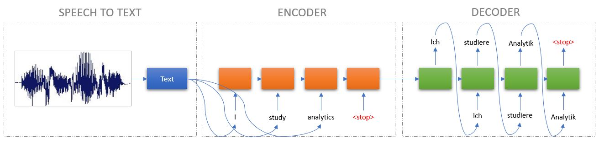
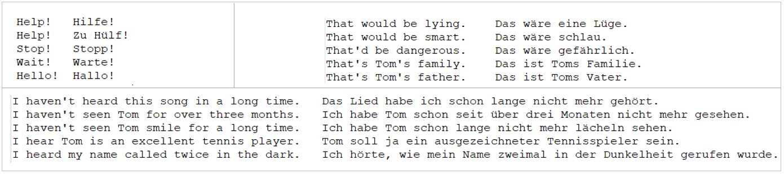

# Speech Recognition and Machine Translation using Sequence to Sequence Models

The idea is to use sequence-to-sequence Recurrent Neural Networks to translate from one language to another. The input sequence is passed through a RNN to obtain the output sequence. The model is flexible such that the lengths of the input sequence and the output sequence can differ. A Speech Recognition layer has also been added on top of the translation framework. The speech recognition layer takes in live speech as input and transcribes it into text which is further treated as the input sequence for the many-to-many RNN which gives the output sequence in the desired langauge.

The architecture could be understood by the below image -

The training data is a 2-column dataset - column 1 containing words/phrase in input language (English) and column 2 containing translations of those in column 1 in the output language (German). Since column 2 is the exact translation of column 1, this takes into account all the grammar rules and patterns and thus helps the RNN learn those patterns and rules.
The dataset has been obtained from - http://www.manythings.org/anki/.

The following packages have been used in this project - 

Speech Recognition - https://pypi.org/project/SpeechRecognition/

PyAudio (only needed when microphone is used) - https://pypi.org/project/PyAudio/

Keras (with TensorFlow backend) - https://keras.io/ 

For instant Speech Recognition, Google Speech API was used. Information on how to use Google Speech API can be found here - https://www.geeksforgeeks.org/speech-recognition-in-python-using-google-speech-api/

**Used parameters -**

Batch size – 64

Epochs – 25

Hidden Neurons – 256

Number of Training Samples – 10000

Optimizer – RMSProp

Train:Test split – 80:20

**Sample Output -**

Input - I am dumb

Model Output - Ich bin sehr gewannt.

Google Translation of model output - I am very well known

Input - Go away!

Model Output - Verschwinde!

Google Translation of model output - Get out!

**Sample Applications -**

1. Only Speech Recognition and transcription into text
  -	Dictating to a system and letting it transcribe into text instead to typing
  -	Video or Audio captions for deaf and hearing-impaired people

2. Only translation of input text given using keyboard
  -	Trying to learn a new language by reading the translated sentences
  -	Helpful to travelers in a foreign country 

3. Speech Recognition and Translation of input speech
  -	Perfecting the pronunciations of words of foreign language by translating and later hearing
  -	Generating subtitles for a movie

